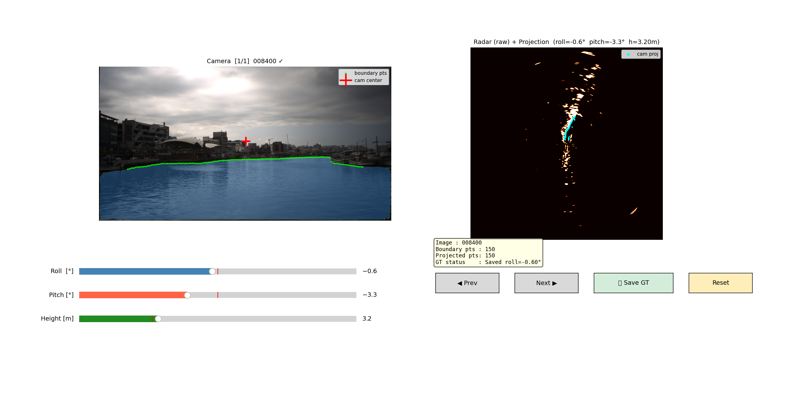
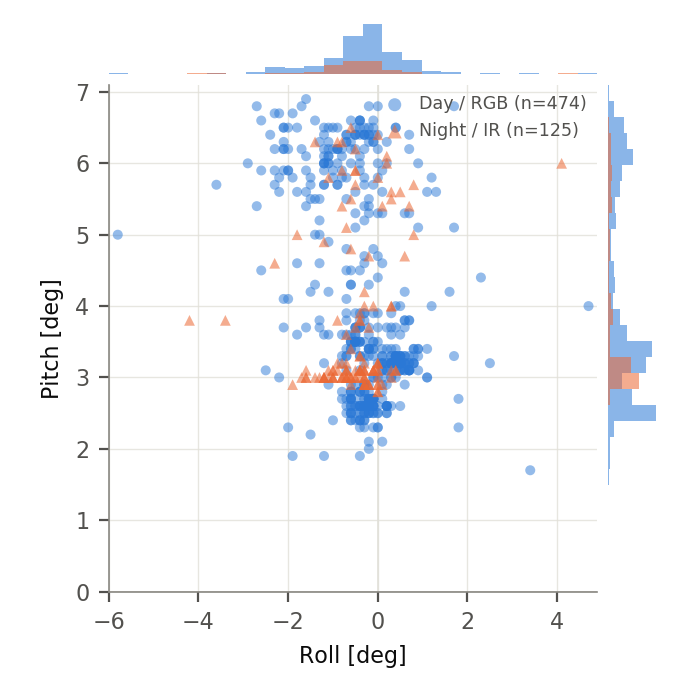
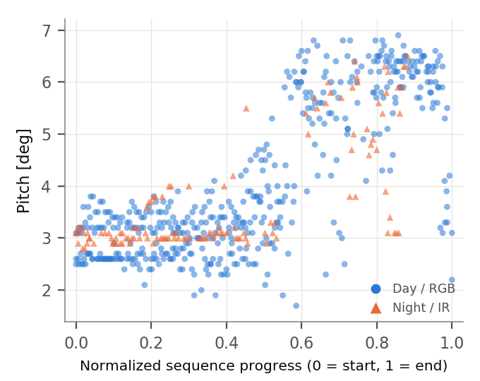

# CRAD: Camera–Radar Alignment Dataset for Maritime Sensor Fusion

CRAD provides **599 manually verified roll / pitch / height reference labels**
for camera–radar frame-level alignment on autonomous surface vessels (ASVs),
built on top of the [Pohang Canal Dataset](https://sites.google.com/view/pohang-canal-dataset).

Camera–radar fusion on ASVs requires frame-level projection alignment under
wave-induced vessel motion. Neither raw AHRS nor a fused GPS+AHRS+LiDAR
trajectory reliably gives the roll/pitch that maximizes camera-radar
projection consistency. CRAD provides a human-verified reference for
evaluating roll/pitch estimation and projection-level camera–radar alignment
methods, generated with a custom projection-based annotation interface.

This repository contains the **labels**, the **annotation tool** used to
produce them, and lightweight tooling to load/plot them. It does **not**
include CROCS, a follow-on algorithm paper from the same authors that
evaluates against these labels — that is a separate codebase; nothing here
depends on it. If you use CROCS, please cite it (see [Citation](#citation)).

## Dataset summary

| Sequence | Type | Time range [s] | # Labels |
|---|---|---|---|
| pohang00 | Day / RGB | 580–2170 | 116 |
| pohang01 | Night / IR | 690–2640 | 83 |
| pohang02 | Day / RGB | 840–2240 | 110 |
| pohang03 | Day / RGB | 800–2420 | 140 |
| pohang04 | Day / RGB | 650–2200 | 108 |
| pohang05 | Night / IR | 470–2170 | 42 |
| **Total** | – | – | **599** |

The number of labeled frames differs by sequence because visual
inspectability varies with illumination, viewpoint, occlusion, radar
sparsity, and environmental conditions — a frame is labeled only when the
annotator judged the camera/radar evidence reliable enough to align with
confidence (there is no automatic exclusion filter).

## What this dataset is *not*

CRAD is a **reference subset**, not absolute ground-truth vessel attitude.
Labels are manually verified for *projection consistency* between the
camera-visible water boundary and the radar-observed structure, not measured
by an independent high-precision attitude sensor. Treat them as a practical,
human-verified reference rather than a calibrated ground truth.

This repository also does **not** include the underlying camera images or
radar scans — those belong to the [Pohang Canal
Dataset](https://sites.google.com/view/pohang-canal-dataset) and must be
obtained separately (see their site for access/license terms). CRAD labels
are keyed by `(sequence, frame_id)` so you can join them to the corresponding
Pohang Canal Dataset frames yourself (`frame_id` is the Pohang Canal Dataset
timestamp index, in deciseconds).

## Repository layout

```
CRAD/
├── labels/
│   ├── gt_labels.csv            # consolidated table, all 6 sequences
│   ├── sequence_summary.csv     # Table I above, machine-readable
│   └── pohang0{0..5}/gt_rph.json
├── examples/
│   ├── load_labels.py           # minimal loader (pandas or stdlib json only)
│   └── plot_distribution.py     # reproduces the figures below
├── annotator/
│   ├── annotate.py              # the manual annotation tool used to build CRAD
│   ├── pohang_calibration.py    # standalone Pohang Canal Dataset calibration loader
│   └── requirements.txt
├── figures/                     # pre-rendered example figures
└── docs/                        # GitHub Pages site (this repo's landing page)
```

## Label format

Per sequence, `labels/pohang0#/gt_rph.json`:

```json
{
  "5800": {"roll_deg": 0.3,  "pitch_deg": 2.6, "height_m": 3.5},
  "5900": {"roll_deg": -0.1, "pitch_deg": 2.6, "height_m": 3.3}
}
```

- Key: `frame_id`, the Pohang Canal Dataset frame timestamp (deciseconds).
- `roll_deg`, `pitch_deg`: degrees, matching the sign convention used in the
  CRAD paper's tables and figures.
- `height_m`: camera height above the radar-referenced sensing plane, in
  meters (initialized at 3.0 m, adjusted in 0.05 m increments).

`labels/gt_labels.csv` is the same data consolidated across all six
sequences, with columns `seq, frame_id, roll_deg, pitch_deg, height_m`.

**Sign convention note:** the annotation tool's sliders (and its native
save format, `annotator/<save_dir>/<seq>/gt_rph.json`, radians) use the
*opposite* sign for roll and pitch from the published labels above — e.g.
the tool screenshot below shows roll=-0.6°, pitch=-3.3° for frame 008400,
while the published label for that same frame is roll=0.6°, pitch=3.3°.
The published labels are negated to match the CRAD paper's convention;
height is unaffected. If you run the annotation tool yourself and compare
its live display against these files, remember to flip the sign of roll
and pitch.

## Annotation protocol

Labels were produced with a custom projection-based annotation interface: a
synchronized camera image and a radar-referenced projection view are shown
side by side, and the annotator adjusts roll/pitch/height sliders (0.1°,
0.1°, 0.05 m steps) to maximize visual consistency between the projected
camera-derived water-boundary cues and the radar-observed structure.
Camera-derived cues were extracted from water-region masks generated by
SAM 3 with the text prompt `"water"`. A frame is skipped (left unlabeled)
whenever the water boundary is unclear, the radar return is too sparse or
cluttered, or the projection cannot be judged reliably — this is an
annotator judgment call made per frame, not an automated filter.

## Annotation tool

`annotator/annotate.py` is the actual interface used to produce every label
in this dataset — the same matplotlib GUI described above (camera + radar
views, roll/pitch/height sliders, Prev/Next/Save/Reset). It is included so
the labeling methodology is fully reproducible/inspectable, not just
described in prose.

<p align="center">
  
</p>

Screenshot: `pohang03`, frame `008400` (roll=-0.6°, pitch=-3.3°, height=3.2 m,
already saved). Left: camera image with the SAM3-derived water boundary
(green). Right: the same boundary projected onto the raw radar image (cyan)
at the saved roll/pitch/height, aligning with the radar-observed structure.

It depends only on this repo (`pohang_calibration.py`, included) plus
standard packages (`numpy`, `opencv-python`, `matplotlib`, `Pillow` — see
`annotator/requirements.txt`); it has **no dependency on CROCS or any
other private codebase**. SAM3 is optional (and needs `torch` itself) — if
it isn't installed, the tool automatically falls back to Canny-edge
boundary extraction.

The radar view is a simple normalized display of the raw radar image —
CRAD does not use an inverse sensor model (ISM). (CROCS, the separate
follow-on algorithm, does use an ISM internally for its own optimization
objective, but that is not part of CRAD or this tool.)

To run it you also need the **raw Pohang Canal Dataset** sequence directory
(`calibration/`, `stereo/left_images/` or `infrared/images/`, `radar/`),
which is not included here (see the dataset link above):

```bash
cd annotator
pip install -r requirements.txt
python annotate.py --data_dir /path/to/pohang/pohang03
```

If you only want to use the published labels, you don't need this tool or
the raw dataset at all — `examples/load_labels.py` is all you need.

**Optional: SAM3 for higher-quality boundaries.** Without SAM3, the tool
uses a Canny-edge fallback, which is noticeably rougher and can latch onto
the wrong edge (e.g. a building skyline) in low-contrast scenes. For
SAM3-quality boundaries (matching the actual published labels), install it
per [facebookresearch/sam3](https://github.com/facebookresearch/sam3)
(requires `torch`) into the same environment, then just run `annotate.py`
normally — no extra flag needed, it is detected automatically via a plain
`import sam3` at startup. `build_sam3_image_model()` downloads the model
checkpoint from the Hugging Face Hub on first use (internet access
required for that one-time download).

## Quick start

```bash
cd examples
python load_labels.py                  # summary stats across all sequences
python load_labels.py --seq pohang03   # summary stats for one sequence
python plot_distribution.py            # regenerates figures/*.png
```

`load_labels.py` needs only `pandas`/`numpy` (the CSV path) — no `pandas`
is needed either if you just want the raw per-sequence JSON via
`load_sequence_json()`, which uses the standard-library `json` module only.

## Example figures

<p align="center">
  
  
</p>

Left: joint roll/pitch distribution, split by Day/RGB and Night/IR
sequences. Right: pitch grows sharply partway through each sequence
(Pearson r ≈ 0.77), consistent with each recording transiting
from a calm inner canal to more wave-exposed open water.

## Citation

If you use CRAD, please cite:

```bibtex
@inproceedings{han2026crad,
  title     = {{CRAD}: Camera-Radar Alignment Dataset for Maritime Sensor Fusion},
  author    = {Han, Sol and Kim, Jinwhan},
  booktitle = {OCEANS 2026},
  year      = {2026}
}
```

CROCS is a follow-on algorithm paper from the same authors. If you use it,
please cite:

```bibtex
@article{han2026crocs,
  title   = {{CROCS}: Camera-Radar Online Alignment via Conic-Section-Constrained Scalar Field Correlation},
  author  = {Han, Sol and Kim, Jinwhan},
  journal = {IEEE Robotics and Automation Letters},
  year    = {2026},
  doi     = {10.1109/LRA.2026.3730370}
}
```

Paper: [ieeexplore.ieee.org/document/11676096](https://ieeexplore.ieee.org/abstract/document/11676096) &middot; DOI: [10.1109/LRA.2026.3730370](https://doi.org/10.1109/LRA.2026.3730370)

Please also cite the underlying Pohang Canal Dataset if you use the
corresponding camera/radar frames:

```bibtex
@article{chung2023pohang,
  title   = {Pohang Canal Dataset: A multimodal maritime dataset for autonomous navigation in restricted waters},
  author  = {Chung, Dongha and Kim, Jeongwoo and Lee, Changyu and Kim, Jinwhan},
  journal = {The International Journal of Robotics Research},
  volume  = {42},
  number  = {12},
  pages   = {1104--1114},
  year    = {2023}
}
```

## Contact

Sol Han — KAIST Mechanical Engineering — dream4future@kaist.ac.kr
